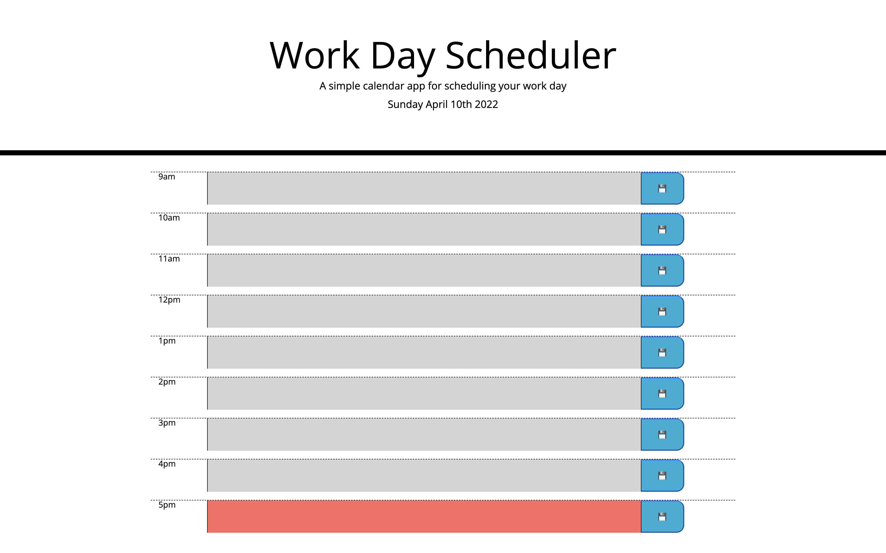

# Calender-Planner

## Hello and welcome to the virtual calender made by Jade!

#### * To navigate through the planner is easy to use! First, the user should take a look at the header to confirm that today's date is the correct day to save some plans in time blocks!

#### * Using this virtual planner is as straight forward as it looks. After comfirming at the top you are making and saving plans as well as events for the correct date, you simply will enter your information in the text box. Once you're entry has been entered, click the floppy disc icon to the right to save your entry or entries!

#### * Once all your plans have been save for the current day, they will stay saved even if you refresh your browser! If you have trouble keeping track of time, no problem. The time blocks are color coded to indicate what blocks are past, present, and future. Quite easy to see what you have already done and what you are coming up on as a user of this planner.

[Click this link to access the virtual calender](https://jadehuynh.github.io/calender-planner/)

## 

 

 

